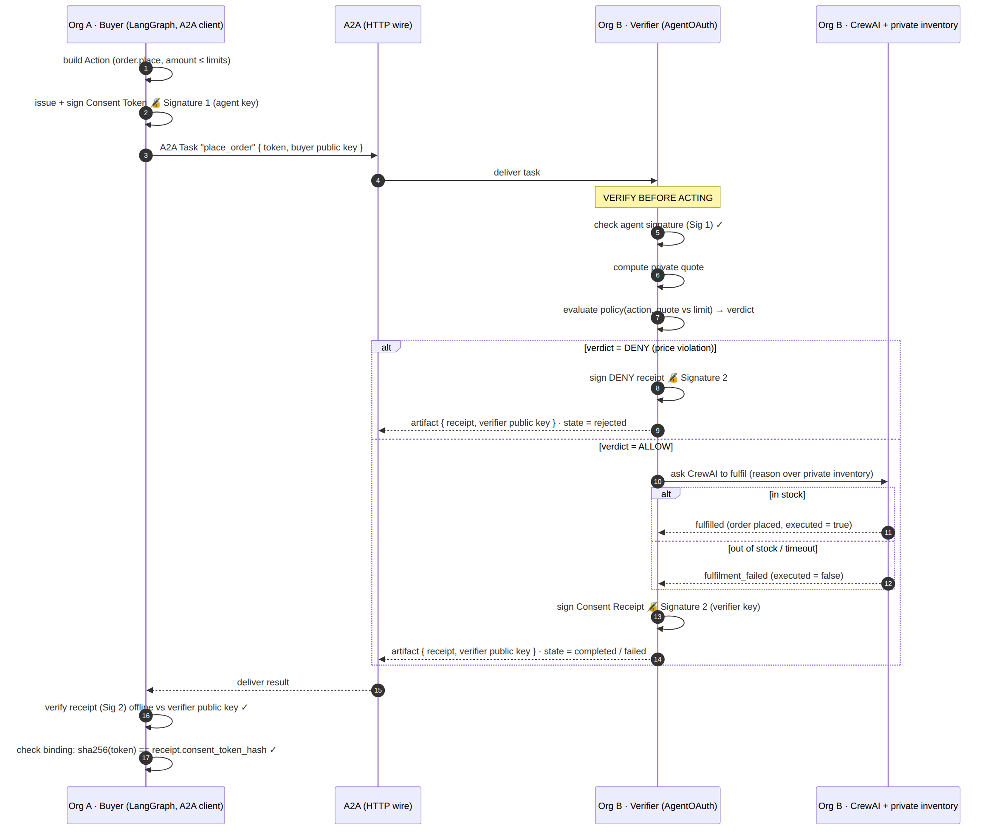

# AgentOAuth over A2A — verifiable authority for cross-org agent interactions

> **A LangGraph agent and a CrewAI agent — no shared code — establish verifiable
> authority between them over A2A.** That proves AgentOAuth is a *protocol*, not a library.

[A2A](https://github.com/a2aproject/A2A) is the **transport**: how two agents discover
each other (Agent Cards) and delegate work (Tasks). [AgentOAuth](https://github.com/agentoauth/agentoauth)
is the **authority layer A2A leaves to implementers**: a policy-bound **Consent Token**
the initiator attaches, and a signed **Consent Receipt** the responder returns — proving
what was authorized and what was done, independently verifiable without contacting anyone.

```
ORG A  (LangGraph, A2A client)                 ORG B  (CrewAI, A2A server)
   issue AgentOAuth Consent Token  ──A2A Task + token──▶  verify token BEFORE acting
   (policy-bound: action ≤ limits)                        reason (CrewAI) over private data
   verify returned receipt  ◀──── signed Consent Receipt ──── return signed receipt (artifact)
```

The full handshake — the two signatures, the verify-before-acting step, and the
ALLOW / DENY / out-of-stock branches ([source](docs/handshake.mmd)):



## Run the handshake in one command

```bash
cd agentoauth-saga
python -m venv .venv && . .venv/bin/activate
pip install -e ".[a2a,supplier]"

python demos/run_handshake.py                 # success     → A2A completed, receipt VALID
python demos/run_handshake.py out_of_stock    # can't fulfil → A2A failed,    receipt VALID
python demos/run_handshake.py price_violation  # over limit  → A2A rejected,  DENY receipt VALID
```

The supplier runs as a **separate process** — the A↔B leg crosses a real HTTP wire. Every
authorized outcome returns a signed, self-verifying receipt; even denials and failures are
accountable. Example success output:

```
  A2A task state     : completed
  decision           : fulfilled (used_llm=False)
  supplier reasoning : Supplier 'acme' has SKU order:XYZ in stock; quoted 40000 USD, within the authorized limit.
  receipt verdict    : ALLOW   executed: True
  receipt SIGNATURE  : VALID ✓ (verified offline against the supplier's verifier key)
```

Or run both agents as containers:

```bash
docker compose up --build         # supplier (Org B) stays up; buyer (Org A) runs the handshake
```

## Live visual demo (the two-signature flow, for video)

A single web service animates the real handshake step-by-step — the agent-signed **Consent Token
(Signature 1)** crossing A2A to the CrewAI verifier, the policy decision, and the verifier-signed
**Consent Receipt (Signature 2)** coming back — and **re-verifies both signatures in your browser**
with WebCrypto. It runs the genuine flow live (with a baked replay fallback so a recording never
breaks).

```bash
pip install -e ".[a2a,supplier,gateway]"
python -m orgs.gateway.server          # → http://localhost:8000
# click Success / Out of stock / Price violation; use Step for narration, or Run to autoplay
```

The gateway lazily launches the CrewAI supplier itself (real A2A wire on localhost) and exposes
`POST /api/handshake {"scenario": ...}` returning the genuine-artifact trace the UI animates.
Regenerate the offline replay traces with `python scripts/gen_traces.py`.

**Deploy to Railway (one service):** the repo ships `railway.json` (Dockerfile build, start
`python -m orgs.gateway.server`, healthcheck `/healthz`). Point Railway at this directory and deploy;
the container binds `0.0.0.0:$PORT` and serves the demo at the Railway URL. Set `OPENAI_API_KEY` /
`ANTHROPIC_API_KEY` to switch the CrewAI supplier to real LLM reasoning. *(Cloudflare Workers can't
run CrewAI/a2a-sdk; only the Python host — Railway or any container platform — fits.)*

## Why two different frameworks

The point is **cross-framework interoperability**. Org A is built with **LangGraph**, Org B with
**CrewAI**; they share no code. They agree only on two open protocols — **A2A** for transport and
**AgentOAuth** for authority — and that is enough to establish a verifiable, accountable interaction
across an organization boundary. If it only worked within one framework, it would be a library, not
a protocol.

## A2A vs AgentOAuth (don't conflate them)

| | A2A | AgentOAuth |
|---|---|---|
| Job | **Transport** — discovery (Agent Cards) + delegation (Tasks) | **Authority** — prove a step was authorized + record what was done |
| Artifact | Task / Message | Consent **Token** (request) + signed Consent **Receipt** (proof) |
| Leaves to you | *who may do what, and proof of it* | — (this is the layer) |

AgentOAuth here reuses the existing Python implementation: **EdDSA attached compact JWS**, mirroring
the TypeScript `sdk-js`/`verifier-api`. The consent token rides in the A2A message metadata; the
supplier verifies it (signature + policy + the crew's quoted price vs. the authorized limit) **before
acting**, then signs and returns the receipt as the A2A artifact.

## The CrewAI supplier (hybrid reasoning)

The supplier is a real CrewAI agent. With an LLM key (`OPENAI_API_KEY` / `ANTHROPIC_API_KEY`) it reasons
over its private inventory and justifies the decision; without one it falls back to a deterministic
decision so the demo runs offline and reproducibly. Either way the supplier's **system of record**
governs stock (an LLM never invents inventory), and the **security-critical authority check** (token
signature + quoted price vs. limit) is enforced by the AgentOAuth verifier, not the LLM.

## Deep cut — the saga across two orgs

The multi-step **Analyst → Finance → Buyer** procurement saga, where the Buyer→Supplier leg is the same
real A2A + CrewAI handshake. `reconcile()` spans both orgs and compensation of Org A's local steps fires
on a cross-org failure:

```bash
python demos/run_happy.py               # COMPLETE
python demos/run_failure.py             # supplier out of stock → COMPENSATED (Finance + Analyst rolled back)
python demos/run_compensation_fails.py  # ERP void fails        → INCONSISTENT (unrecovered step flagged)

saga-view saga_failure.json             # CLI table, labelled by org · framework
# or open src/agentoauth_saga/viewer/web/index.html and load a saga*.json (offline, no backend, no storage)
```

## Architecture

```
orgs/buyer/      LangGraph agent + A2A client   (Org A, initiator)   ── imports langgraph, a2a
orgs/supplier/   CrewAI agent + A2A server      (Org B, responder)   ── imports crewai, a2a
orgs/common/     A2A ↔ AgentOAuth bridge (token attach/extract, receipt artifact)
        │ uses
        ▼
src/agentoauth_saga/   CORE — framework- & A2A-agnostic
  consent · verifier · policy · receipts · reconcile · saga (thin orchestrator) · viewer
```

The core never imports `a2a`, `langgraph`, or `crewai` — enforced by `tests/test_layering.py`. The
orchestrator delegates the cross-org leg through a `remote_handler` callable, so it stays A2A-agnostic
while the receipt the remote org signs is linked into the same chain and verified offline.

## Interop with the canonical TypeScript verifier (the truth check)

`tests/test_interop_ts.py` is **not mocked**. It drives the real TS `canonicalize.ts` and `jose` (the
library the TS SDK/verifier sign with) to prove:

1. canonicalization is **byte-identical** to TS `hashPolicy` (floats, nested objects, unicode, key order);
2. a **Python-issued** token verifies under the **TS** verifier;
3. a **TS-issued** token verifies in **Python**.

```bash
# from the monorepo root, once:
pnpm install && pnpm --filter @agentoauth/sdk build
# then:
cd agentoauth-saga && pytest tests/test_interop_ts.py
```

The test skips cleanly when the TS toolchain isn't present, so the Python suite stays green offline.

## Tests

```bash
pip install -e ".[a2a,supplier,dev]"
pytest                      # core + policy/reconcile/chain + handshake & saga e2e (real wire) + layering
pytest tests/test_interop_ts.py   # TS interop (needs the TS build above)
```

## Configuration (env, no secrets in code)

| Var | Default | Meaning |
|---|---|---|
| `SUPPLIER_MODE` | `available` | `available` / `out_of_stock` / `price_violation` / `timeout` |
| `SUPPLIER_HOST` / `SUPPLIER_PORT` / `SUPPLIER_PUBLIC_URL` | `127.0.0.1` / `9999` / derived | supplier bind + advertised Agent Card URL |
| `SUPPLIER_URL` | — | buyer connects to an existing supplier (set by docker-compose) |
| `OPENAI_API_KEY` / `ANTHROPIC_API_KEY` | — | switch the CrewAI supplier to real LLM reasoning |
| `SAGA_KEY_SEED` | random | deterministic per-org keys for reproducible runs |
| `SAGA_OUT_DIR` | cwd | where saga demos write `saga*.json` |

## Layout

```
src/agentoauth_saga/   consent/ verifier/ policy/ receipts/ saga/ viewer/   # core (agnostic)
orgs/
  buyer/      client.py graph.py saga.py        # LangGraph + A2A client
  supplier/   server.py executor.py crew.py inventory.py   # CrewAI + A2A server
  common/     a2a_consent.py                    # the only A2A↔AgentOAuth bridge
  gateway/    server.py trace.py supplier_manager.py static/   # live two-signature visual demo
demos/   run_handshake.py  run_happy.py run_failure.py run_compensation_fails.py
tests/   test_handshake_e2e.py test_saga_e2e.py test_interop_ts.py test_layering.py
         test_policy.py test_reconcile.py test_receipts_chain.py test_verifier.py ...
Dockerfile  docker-compose.yml
```

## Notes / honest deviations

- There is no AgentOAuth *Python* SDK upstream (it's TypeScript). We re-implement the **same** EdDSA
  compact-JWS scheme in Python (no new crypto) and prove wire-compatibility in `test_interop_ts.py`.
- `a2a-sdk` is pinned to **0.3.7** (the sample-aligned, pydantic API). The 1.x line is a protobuf
  rewrite that drops `A2AStarletteApplication`/`A2AClient`.
- Key distribution is trust-on-first-use for the demo (each signed object carries its signer's public
  JWK). Production would resolve keys from each org's published JWKS / Agent Card.
- `CONFIRM` is a saga-local verdict (AgentOAuth receipts are ALLOW/DENY); it's decided by the local
  policy engine and never round-trips through a remote verifier.

## License

MIT — consistent with AgentOAuth.
